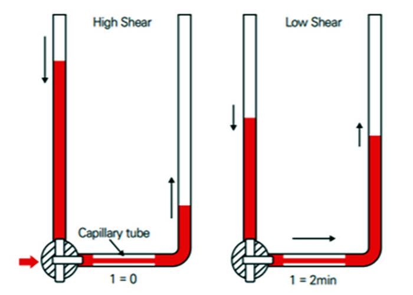

# Blood_Viscometer
Development of blood viscosity calculation program using deep learning

## Introduce

## Data
* **데이터 세부 구성 및 정보는 비공개 **
* 스캐닝 모세관법을 이용한 혈액점도검사 측정 데이터

## Method
* DNN
* CNN
* TabNet
* ConvLSTM
